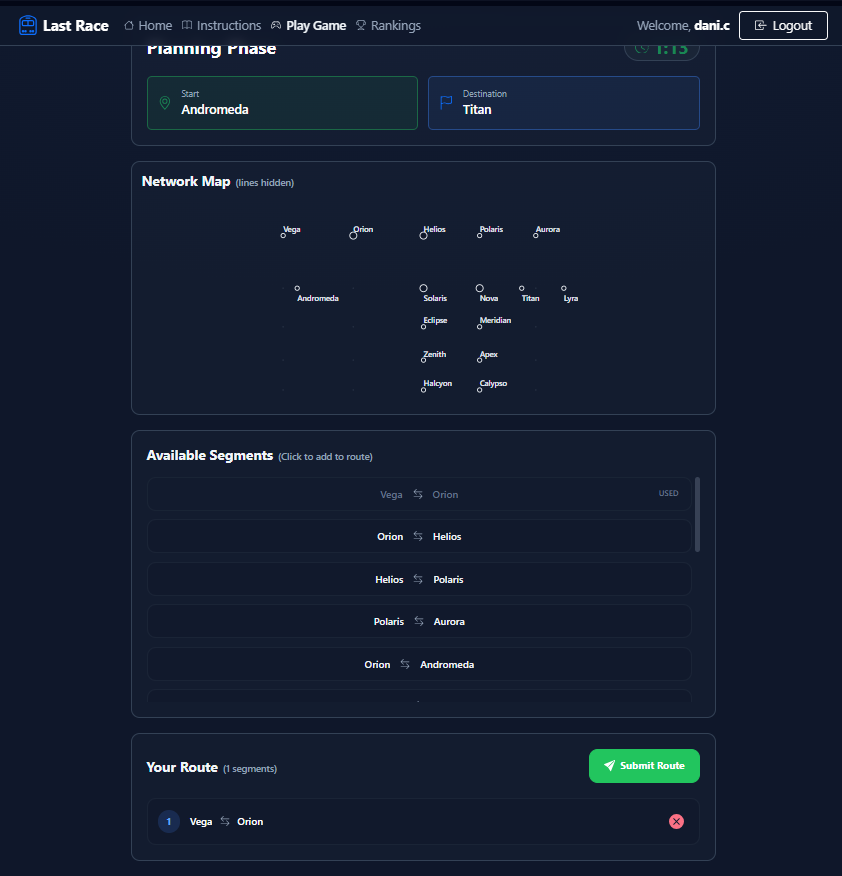
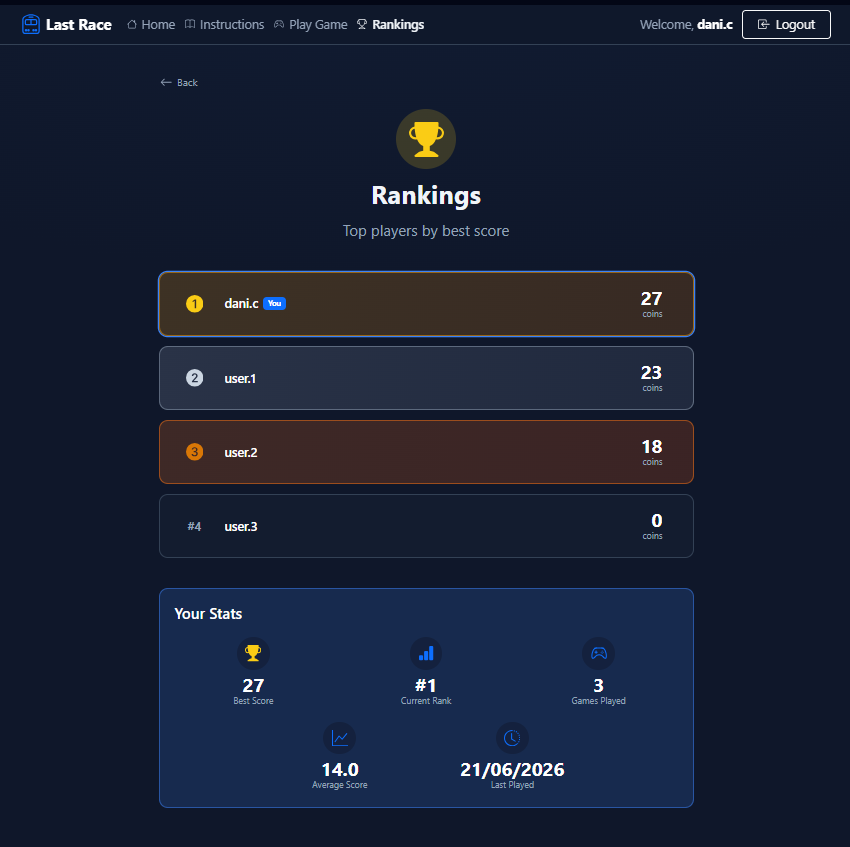

# Exam #1: "Last Race"
## Student: s349472 CATALANO DANIELE

## React Client Application Routes

- Route `/`: Home page - hero section with metro animation, quick-action cards (Start Game / View Rankings for logged-in users; Login / Instructions for guests) and a feature summary.
- Route `/login`: Login form. Redirects to `/` if the user is already authenticated.
- Route `/instructions`: Static page explaining the game rules and scoring system.
- Route `/game` *(protected)*: Main game page. Hosts the four-phase game flow - **Setup , Planning , Execution , Result** - rendered by `GamePage` without a full page reload.
- Route `/rankings` *(protected)*: Leaderboard showing all users sorted by best score, plus the current user's personal statistics.
- Route `*`: 404 Not Found page.

## API Server

### Authentication

- **POST** `/api/sessions`
  - Request body: `{ username: string, password: string }`
  - Response: user object `{ id, username, email, bestScore }` (201) or `{ error }` (401)

- **GET** `/api/sessions/current`
  - No parameters.
  - Response: user object (200) or `{ error: 'Not authenticated' }` (401)

- **DELETE** `/api/sessions/current`
  - No parameters.
  - Response: 200 with empty body (logout)

### Game (all require an authenticated session)

- **GET** `/api/users/ranking`
  - No parameters.
  - Response: array of `{ id, username, best_score }` sorted by `best_score` descending.

- **GET** `/api/games/stats`
  - No parameters.
  - Response: `{ games_played, best_score, avg_score, last_played }` for the current user.

- **GET** `/api/network`
  - No parameters.
  - Response: `{ lines: [...], stations: [...], segments: [...] }` - full metro network data including line colours, interchange flags, and station names for each segment.

- **POST** `/api/games`
  - No request body.
  - Server runs BFS to pick a random valid (start, destination) pair with a minimum shortest path of 3 segments, then creates an incomplete game record.
  - Response (201): `{ gameId, startStation: { id, name }, destStation: { id, name } }`

- **DELETE** `/api/games/:gameId`
  - URL param: `gameId` (integer ≥ 1).
  - Deletes an incomplete game belonging to the current user.
  - Response: 204 No Content.

- **POST** `/api/games/:gameId/route`
  - URL param: `gameId` (integer ≥ 1).
  - Request body: `{ route: number[] }` - ordered array of segment IDs chosen by the player.
  - Server validates the route (connectivity, no duplicate segments, line changes only at interchange stations, reaches destination) then executes it step-by-step assigning a random event per segment (coin change in `[-4, +4]`). Starting coins: 20.
  - Response: `{ valid: boolean, invalidReason: string|null, steps: [{ fromStation, toStation, event, coinChange, runningTotal }], finalScore: number }`

## Database Tables

| Table | Columns | Purpose |
|-------|---------|---------|
| `users` | `id`, `username` (unique), `email`, `hash`, `salt`, `best_score` | Stores registered users. Password saved as scrypt hash+salt. `best_score` is updated after each completed game. |
| `lines` | `id`, `name` (unique), `color` | Metro lines of the network. `color` is a hex string used to render the map. |
| `stations` | `id`, `name` (unique), `is_interchange` | Metro stations. `is_interchange = 1` if the station is served by more than one line. |
| `segments` | `id`, `line_id`, `from_station`, `to_station` | Direct rail connections between two stations on a given line. `line_id` references `lines`; `from_station` and `to_station` reference `stations`. The combination (line, from, to) is unique. |
| `events` | `id`, `description`, `coin_change` | Pool of random events applied per segment during execution. `coin_change` is an integer between -4 and +4. |
| `games` | `id`, `user_id`, `start_station`, `dest_station`, `score`, `date_played` | One row per game session. `user_id`, `start_station`, `dest_station` reference `users` and `stations`. `score` is NULL while the game is in progress and set to the final coin total on submission. |

## Main React Components

- `AuthContext.js`: Creates the React context object via `React.createContext()`. It is the shared "slot" that `AuthProvider` fills with values and every other component reads via `useContext(AuthContext)`.
- `AuthProvider.jsx`: Wraps the entire app and holds the authentication state (`user`, `loading`). On mount it calls `GET /api/sessions/current` to restore an existing session. Exposes `login()` (calls `POST /api/sessions`, updates `user` state) and `logout()` (calls `DELETE /api/sessions/current`, clears `user` state) to all descendants through `AuthContext`.
- `NavHeader.jsx`: Sticky top navbar. Shows Home and Instructions for everyone; adds Play Game and Rankings links when logged in. Displays the current username and a Logout button, or a Login button for guests.
- `HomePage.jsx`: Landing page. Renders the hero title, `MetroAnimation`, context-aware quick-action cards, and the game-features summary row.
- `LoginPage.jsx`: Login form that calls `POST /api/sessions` and updates the auth context on success.
- `InstructionsPage.jsx`: Static page describing the three game phases and scoring rules.
- `GamePage.jsx`: Orchestrator for the full game session. Loads network data on mount and switches between the four sub-phases (`setup → planning → execution → result`) without re-mounting.
- `SetupPhase.jsx`: First phase - displays the full metro map with coloured lines, lists interchange stations and starting coins, then lets the player begin the planning countdown.
- `PlanningPhase.jsx`: Second phase - 90-second countdown timer; shows the map without line colours; lets the player build a route by clicking segments from a list (each segment can be used only once); auto-submits when the timer expires.
- `ExecutionPhase.jsx`: Third phase - replays the journey step by step; reveals the random event and coin change for each segment as the player clicks "Next"; handles invalid routes with an error screen.
- `ResultPhase.jsx`: Fourth phase - shows the final score, a "New Personal Best" banner when applicable, the user's updated stats via `UserStats`, and buttons to play again or view the leaderboard.
- `MetroMap.jsx`: SVG-based metro network diagram. Accepts a `showLines` prop to toggle coloured line rendering (shown in Setup, hidden in Planning). Interchange stations are drawn with a larger radius.
- `UserCardRanking.jsx`: Single leaderboard entry card. Uses gold/silver/bronze icon styling for the top three ranks and highlights the current user's row.
- `UserStats.jsx`: Personal statistics card - best score, current rank, total games played, average score, last played date.
- `MetroAnimation.jsx`: Decorative animated graphic on the home page.

## Screenshot

## Users Credentials

| Username | Password    |
|----------|-------------|
| `user.1` | `password!` |
| `dani.c` | `password!` |
| `user.2` | `password!` |
| `user.3` | `password!` |

## Use of AI Tools

Perplexity Pro was used during development for styling and UI layout (component structure, CSS classes, visual hierarchy), for decision-making on architectural choices (how to split the game phases, how to organise the context), and for debugging (understanding error messages, fixing unexpected React behaviour). All suggestions were reviewed, manually adapted to the project's specific requirements, and verified.
